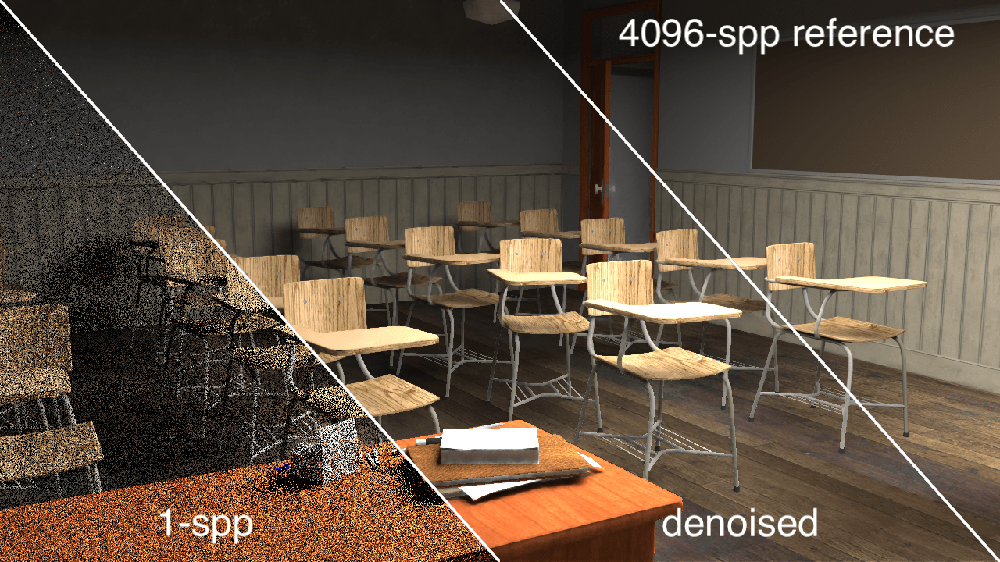
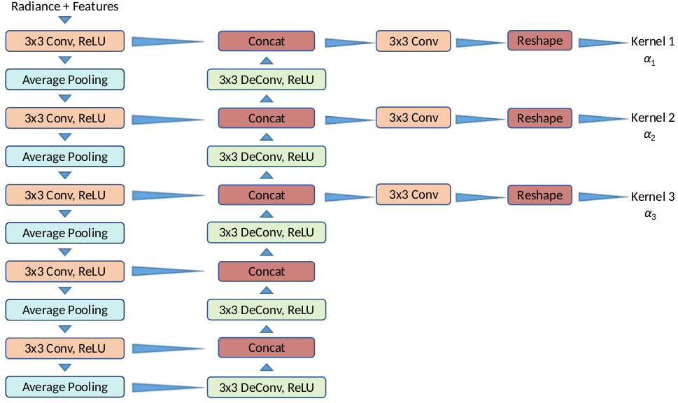

# MultiResolutionKernelPredictionCNN
A Multi-Resolution variant of Kernel Prediction CNN (MR-KP) denoiser

We have adapted the Multi-Resolution [Kernel Prediction CNN (MR-KP) denoiser](https://dl.acm.org/doi/10.1145/3072959.3073708), which decreases the run time of a basic kernel prediction architecture to the order of tens of milliseconds (35ms on a Nvidia RTX 2080 GPU).


### The structure of the network



### The structure of the pyramid-denoiser:


### Citation
If you find this implementation useful in your research, please consider citing:
```
@article{10.1145/3072959.3073708, 
  author = {Bako, Steve and Vogels, Thijs and Mcwilliams, Brian and Meyer, Mark and Nov\'{a}K, Jan and Harvill, Alex and Sen, Pradeep and Derose, Tony and Rousselle, Fabrice}, 
  title = {Kernel-Predicting Convolutional Networks for Denoising Monte Carlo Renderings}, 
  year = {2017}, 
  issue_date = {July 2017}, 
  publisher = {Association for Computing Machinery}, 
  address = {New York, NY, USA}, 
  volume = {36}, 
  number = {4}, 
  issn = {0730-0301}, 
  url = {https://doi.org/10.1145/3072959.3073708}, 
  doi = {10.1145/3072959.3073708}, 
  journal = {ACM Trans. Graph.}, 
  month = jul, 
  articleno = {97}, 
  numpages = {14}, 
  keywords = {global illumination, Monte Carlo denoising, Monte Carlo rendering} 
}
@inproceedings {Meng2020Real, 
  booktitle = {Eurographics Symposium on Rendering 2020}, 
  title = {{Real-time Monte Carlo Denoising with the Neural Bilateral Grid}}, 
  author = {Xiaoxu Meng, Quan Zheng, Amitabh Varshney, Gurprit Singh, Matthias Zwicker}, 
  year = {2020}, 
  publisher = {The Eurographics Association}, 
}
```
### Prerequisite Installation
* Python3
* TensorFlow 1.13.1
* Pillow 6.1.0 (or newer)
* scikit-image 0.16.1 (or newer)
* OpenEXR 1.3.2 (or newer)

### Test with the Pre-trained Models
1. Clone this repo, and we'll call the directory `${MCDNBG_ROOT}`.
2. Download pre-trained models ["classroom"](https://www.dropbox.com/sh/8o7yijfc6rvba16/AADVi0wNoLrRbSgPBIvgcftsa?dl=0) and put the pretrained model to `${MCDNBG_ROOT}/classroom/model`.
3. Download the [1-spp dataset (19GB)](https://etsin.fairdata.fi/dataset/0ab24b68-4658-4259-9f1d-3150be898c63/data) or the [packed testdata for scene "classroom" (1.4GB)](https://www.dropbox.com/s/i8lqh6ezzeymwr9/bw_data_128x128_1scenes_60ips_50ppi_test.tfrecords?dl=0).
If you are using 
4. Recompile the bilateral kernels by running
```
cd bilateral_kernels
./bilateral_kernel.sh
cd ..
```
5. Apply the denoiser by running
```
python network_test.py
```
   - Input
     - If you use the [1-spp dataset (19GB)](https://etsin.fairdata.fi/dataset/0ab24b68-4658-4259-9f1d-3150be898c63/data), please change the data-path in the argument list:
     ```
     python network_test.py -d ${your-data-path}
     ```
     - if you use the [packed testdata for scene "classroom" (1.4GB)](https://www.dropbox.com/s/i8lqh6ezzeymwr9/bw_data_128x128_1scenes_60ips_50ppi_test.tfrecords?dl=0), please put the tfrecords file in `${MCDNBG_ROOT}`.
   - There are a few options in the arguments:
     ```
     --export_exr ## export the exr file of the 1-spp radiance, denoised image, and ground truth
     --export_all ## export all the denoised images from the lower-resolution layers
     ```
6. Evaluate the outputs by running:
```
python evaluation.py -d "classroom"
```
   - The per-frame PSNR, SSIM, RMSE, SMAPE, and relative-MSE are saved in `${MCDNBG_ROOT}/classroom/result/evaluations`
   - The SSIM errormaps and relative-MSE errormaps are saved in `${MCDNBG_ROOT}/classroom/result/evaluations`

### Retrain Your Own Model
Run "python network_train.py"

### Comparison with Neural Bilateral Grid Denoiser (MR-KP)
Please visit [our implementation of MR-KP](https://github.com/xmeng525/RealTimeDenoisingNeuralBilateralGrid) for more information.
